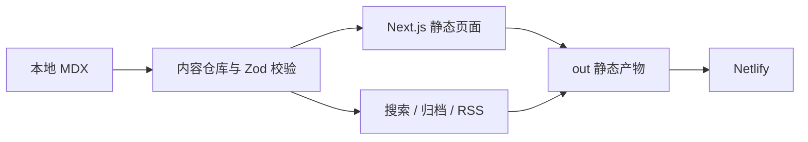

# Eelex Blog

> 一个关于代码、界面设计与持续学习的个人知识库。

[](https://github.com/Ee1ex/eelex-blog/actions/workflows/ci.yml)


[在线阅读](https://harmonious-sprite-8b742a.netlify.app/) · [浏览文章](https://harmonious-sprite-8b742a.netlify.app/#content) · [查看源码](https://github.com/Ee1ex/eelex-blog)

Eelex Blog 用本地 MDX 管理文章、学习笔记与工具分享，把内容发现、沉浸阅读和静态发布收拢在一个轻量仓库中。它没有账号、数据库或 CMS，内容和代码一起版本化，构建后可以直接部署为静态站点。

<p align="center">
  
  
</p>

## 核心体验

| 场景 | 体验 |
| --- | --- |
| 内容发现 | 全局即时搜索、分类与标签筛选、按年份归档 |
| 阅读 | 预计阅读时间、文章目录、复制链接、上一篇/下一篇、返回顶部 |
| 个性化 | 亮色、暗色、跟随系统，以及纯色与横幅背景切换 |
| 内容分发 | 静态 RSS、Sitemap、页面级 SEO 和清晰的 404 页面 |
| 响应式 | 桌面三栏知识库布局，移动端收拢为专注阅读的单列界面 |

## 内容如何流动



文章、学习笔记和工具分享共用同一份内容模型。页面在构建阶段生成；搜索、筛选与显示偏好在浏览器端完成，不依赖自建后端。

## 本地运行

需要 Node.js `24.18.0` 与 pnpm `11.17.0`。

```bash
corepack pnpm install --frozen-lockfile
corepack pnpm dev
```

启动后访问 `http://localhost:3000`。

## 添加一篇内容

在 `content/` 中创建 `.mdx` 文件，并填写统一的 Frontmatter：

```mdx
---
slug: example-post
title: 示例文章
excerpt: 用一句话说明读者会获得什么。
publishedAt: 2026-08-22
category: 文章
tags: [前端, 学习笔记]
cover: /content/example-cover.png
coverAlt: 示例文章封面说明
---

从这里开始写正文。
```

`cover` 与 `coverAlt` 可以省略；未设置封面时，站点会使用项目内的默认阅读封面。

## 项目结构

```text
content/                 本地 MDX 内容
public/                  头像、横幅与文章图片
src/app/                 页面、路由、SEO、RSS 与 Sitemap
src/components/          导航、搜索、内容卡片与阅读组件
src/content/             内容模型、读取、校验与搜索逻辑
src/site/                公开资料与站点配置
tests/                   Vitest 契约与回归测试
docs/                    PRD、需求、技术方案与进度记录
```

## 质量检查

```bash
corepack pnpm check
```

该命令依次执行格式检查、类型生成与 TypeScript 检查、ESLint、Vitest 和生产构建。CI 还会检查依赖的 peer 关系与生产依赖安全公告。

## 静态部署

```bash
corepack pnpm build
```

Next.js 会把静态站点导出到 `out/`。仓库中的 `netlify.toml` 已将该目录设为发布目录，因此部署产物不需要 Next.js 运行时。

## 项目文档

- [产品需求](./docs/PRD.md)
- [文档治理与当前索引](./docs/README.md)
- [参考博客体验需求](./docs/REQ-20260820-01-reference-blog-experience.md)
- [参考博客体验技术方案](./docs/DEV-20260820-01-reference-blog-implementation.md)

## 联系

由 [Eelex](https://github.com/Ee1ex) 设计与维护。问题与建议可以通过 [GitHub](https://github.com/Ee1ex) 反馈。
